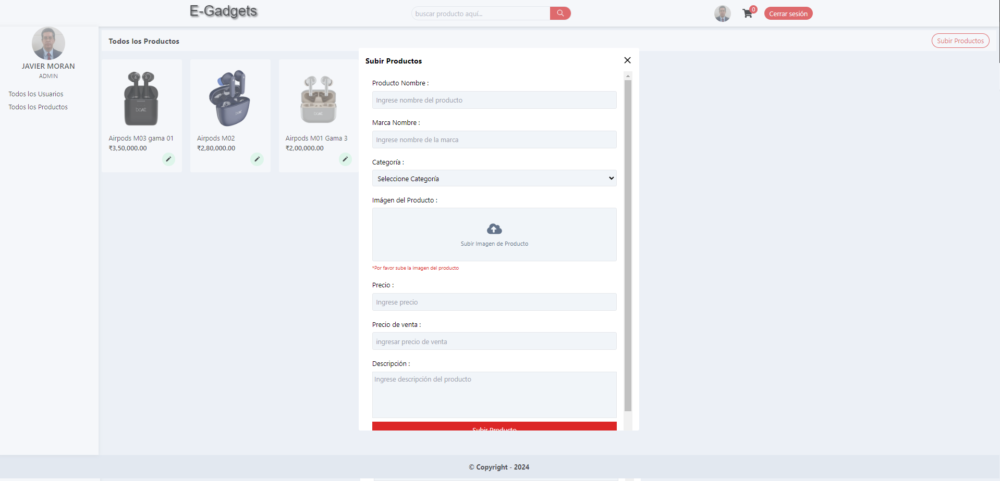

# E-Gadgets Backend (Stack MERN)

E-Gadgets Backend es la parte del servidor del e-commerce de tecnología E-Gadgets. Este proyecto utiliza el stack MERN (MongoDB, Express, React, Node.js) para proporcionar una API robusta y escalable que gestiona las operaciones del e-commerce.

## 🛠️ Tecnologías

  <table>
    <thead>
      <tr>
        <th>Back-End</th>
      </tr>
    </thead>
    <tbody>
      <tr>
        <td>
          
          
          
        </td>
      </tr>
    </tbody>
  </table>

## 🧑‍🤝‍🧑 Equipo

  <dl>
    <dd>
      <h3>🛠️ Full-Stack</h3>
      <dl>
        <dd>
          <table>
            <thead>
              <tr>
                <th>Nombre</th>
                <th>Github</th>
                <th>Linkedin</th>
              </tr>
            </thead>
            <tbody>
              <tr>
                <td>Javier Morán</td>
                <td>
                  
                </td>
                <td>
                  
                </td>
              </tr>
            </tbody>
          </table>
        </dd>
      </dl>
    </dd>
  </dl>

## 📄 Licencia

Este proyecto está bajo la Licencia MIT. Consulta el archivo [LICENSE](LICENSE) para más detalles.

## 🎉 Agradecimientos

Agradecemos a todos los colaboradores y a la comunidad de desarrolladores que han hecho posible este proyecto.

## 🛠️ Instalación y Ejecución

| Paso                  | Instrucción                                                     |
|-----------------------|-----------------------------------------------------------------|
| **Clonar el repositorio** | `git clone https://github.com/tecnycompu/E-Gadgets-Backend.git` |
| **Navegar al directorio** | `cd E-Gadgets-Backend`                                       |
| **Instalar dependencias** | `npm install`                                                |
| **Ejecutar el proyecto**  | `npm run dev`                                                  |

## 🔗 Repositorio

| Repositorio              | Enlace                                                        |
|--------------------------|---------------------------------------------------------------|
| **Repositorio en GitHub** | [E-Gadgets-Backend](https://github.com/tecnycompu/E-Gadgets-Backend) |

---

¡Esperamos que disfrutes trabajando con E-Gadgets Backend tanto como nosotros disfrutamos desarrollándolo!
